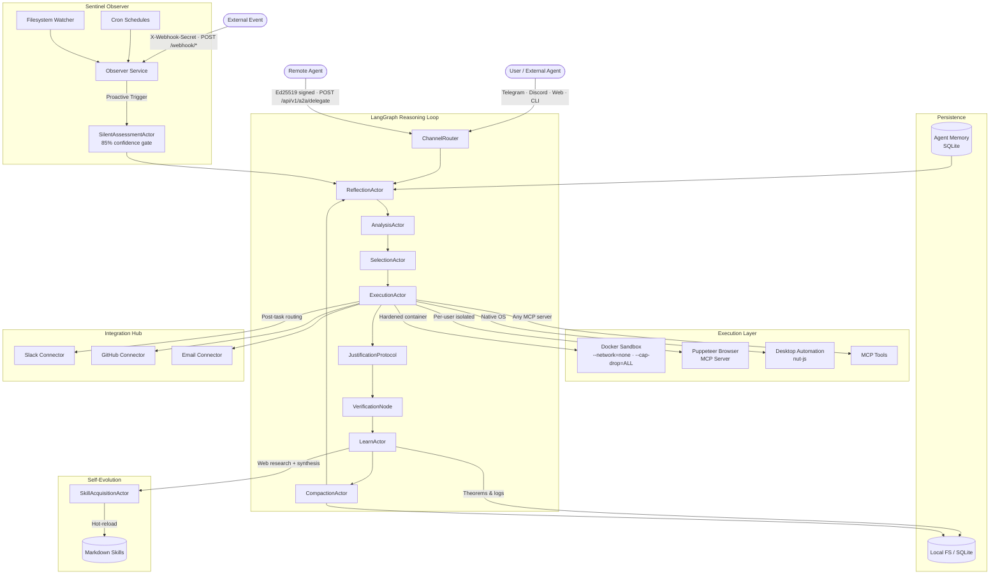

<p align="center">
  
</p>

<p align="center">
  
  
  
  
  
  
</p>

# MidpointX — Sovereign AI Agent Framework

**MidpointX** is a production-grade, self-contained multi-agent reasoning engine. It runs a stateful **LangGraph** cognitive loop across 15+ specialized actor nodes, executes tools inside a **hardened Docker sandbox**, and learns autonomously by synthesizing new skills from web research — all without any cloud infrastructure dependency.

Connect it to Telegram, Discord, a web UI, or another agent via the cryptographically authenticated **A2A (Agent-to-Agent) API** and point it at any of six LLM providers.

---

## Table of Contents

- [What's New](#whats-new)
- [Architecture](#architecture)
- [Key Features](#key-features)
- [Quick Start](#quick-start)
- [Configuration](#configuration)
- [LLM Providers](#llm-providers)
- [Input Channels](#input-channels)
- [Integration Hub](#integration-hub)
- [Persistent Memory](#persistent-memory)
- [Visual Pipeline Builder](#visual-pipeline-builder)
- [Swarm Visualizer](#swarm-visualizer)
- [Browser Sessions](#browser-sessions)
- [Skill System](#skill-system)
- [Tool System](#tool-system)
- [A2A Delegation API](#a2a-delegation-api)
- [API Reference](#api-reference)
- [Security](#security)
- [Project Structure](#project-structure)

---

## What's New

| Feature | Description |
|---|---|
| **Swarm Visualizer** | Live multi-agent coordination UI — spawn, progress, and completion events streamed in real-time via Socket.io |
| **Persistent Memory** | SQLite-backed agent memory with confidence scoring, CRUD browser UI, and automatic prompt injection |
| **Integration Hub** | Slack, GitHub, and Email connectors — configure credentials in Settings and route task output to any channel |
| **Integration Routing** | Chat input pill-bar (⚡ Slack · 🐙 GitHub · 📧 Email) instructs the agent to deliver results to a connector |
| **Visual Pipeline Builder** | ReactFlow drag-and-drop workflow editor with BFS execution engine and persistent run history |
| **Browser Session Rehydration** | Serialize Puppeteer sessions (cookies, storage) and restore them in a visible Chrome window |
| **Connector Credential UI** | Enter Slack, GitHub, and SMTP credentials directly from the Settings page — no `.env` editing required |
| **Anthropic Skill Pack** | 5 official Anthropic skills bundled: Claude API reference, skill creator, frontend design, DOCX, PPTX |

---

## Architecture



---

## Key Features

### 🧠 Cognitive Architecture
- **15+ LangGraph actor nodes** — Reflect, Analyze, Select, Execute, Justify, Verify, Learn, Compact, Prune, and dedicated swarm workers (Researcher, Developer, Tester)
- **Human-in-the-Loop breakpoint** — hard interrupt gate before destructive actions with a 30-second undo window
- **Self-healing resilience** — configurable retry with exponential backoff via `p-retry`
- **Context compaction** — automatic summarization when context window pressure builds

### 🐳 Hardened Docker Sandbox
- All shell commands run inside a resource-capped Docker container by default
- Security flags: `--network=none`, `--memory=512m`, `--cpus=0.5`, `--pids-limit=64`, `--read-only`, `--cap-drop=ALL`, `--security-opt=no-new-privileges`
- Graceful fallback to host shell with a loud warning if Docker is unavailable

### 🤖 Multi-Provider LLM
- Switch providers with a single env var: **Anthropic**, **OpenAI**, **OpenRouter**, **Google Gemini**, **NVIDIA NIM**, **Ollama** (local)
- Separate expert and worker model tiers for cost efficiency
- Extended thinking enabled for Claude models (32k token budget)

### 🕸️ Swarm Visualizer
- Live multi-agent coordination dashboard in the **Swarm** view
- Real-time `AgentCard` tiles show each sub-agent's role, status, and progress
- Socket.io events: `swarm:agent_spawned`, `swarm:agent_progress`, `swarm:agent_message`, `swarm:agent_complete`, `swarm:agent_error`

### 🧩 Persistent Memory
- SQLite-backed memory store (`src/workspace/midpointx.db`) with four types: `fact`, `project`, `preference`, `learned`
- Confidence scoring: 1.0 for user-entered, 0.7 for agent-discovered
- **MemoryBrowser** UI — search, add, and delete memories without touching the database
- Top 10 memories automatically injected into every agent prompt

### 🔌 Integration Hub
- **Slack** — post task summaries to a channel (Bot Token + `chat:write` scope)
- **GitHub** — create issues summarizing completed work (PAT + `repo` scope)
- **Email** — SMTP-based dispatch (host, port, username, password)
- All connectors degrade gracefully when uncredentialed (warn + no-op, no crash)
- Configure credentials in **Settings → Configuration Center** — no `.env` editing required

### 🔀 Visual Pipeline Builder
- ReactFlow canvas with drag-and-drop node palette: Trigger, Condition, Action, Agent
- BFS executor traverses graphs from trigger nodes, logging each step
- Pipelines persisted to `src/workspace/pipelines/` as JSON
- Run history (last 50 per pipeline) accessible from the UI

### 👁️ Proactive Sentinel
- **Cron-triggered skills** — any skill can declare a cron schedule; the Observer fires it autonomously
- **Filesystem watching** — react to file changes in any monitored directory
- **Webhook listener** — `POST /webhook/:path` routes external events into the reasoning loop
- **85% confidence gate** — `SilentAssessmentActor` classifies triggers as DROP / NOTIFY / ACTION before committing resources
- **Rate limiter (3:15 rule)** — max 3 autonomous triggers per intent per 15 minutes

### 🌐 Browser Automation
- Per-user isolated Puppeteer instances (each with its own Chrome profile on disk)
- Headless (API) or visible mode with live hot-switching
- Session serialization: cookies, DOM snapshots, `localStorage`/`sessionStorage` rehydration across restarts

### 🖥️ Desktop Automation
- Native mouse/keyboard control via `nut-js`
- `scan_screen` — LLM-readable description of active windows
- `find_element` — locate any UI element by natural-language description
- Grid-based visual grounding — 12×8 labeled overlay (A1–L8) for pixel-perfect clicking

### 🔗 A2A Agent Delegation
- Cryptographic handshake: **Ed25519 payload signatures** + safety certificate
- Path-scoped security envelopes enforce strict directory boundaries
- Non-repudiable audit ledger with hash chaining

### 📚 Self-Evolving Skill System
- Capabilities are defined as **Markdown skill files** in `src/plugins/skills/`
- `SkillAcquisitionActor` searches the web (DuckDuckGo), synthesizes new skill files with the LLM, and **hot-reloads** them into the live registry — no restart required
- Skills can declare `schedule`, `watchPath`, or `webhookPath` frontmatter to become autonomous proactive triggers

---

## Quick Start

### Prerequisites

- Node.js **22+**
- Docker Desktop (for the sandbox; optional but recommended)
- An API key for at least one [LLM provider](#llm-providers)

### Installation

```powershell
# Clone
git clone https://github.com/VectorZen217/MidpointX-G.git
cd MidpointX-G

# Install backend dependencies
npm install

# Install frontend dependencies
npm install --prefix frontend
```

### Environment Setup

```powershell
Copy-Item .env.example .env
```

Edit `.env` with your provider key and model names:

```env
ACTIVE_LLM_PROVIDER="anthropic"
ACTIVE_MODEL_NAME="claude-opus-4-8"
WORKER_MODEL_NAME="claude-haiku-4-5-20251001"
ANTHROPIC_API_KEY="sk-ant-..."
```

### Run

```powershell
# Full stack (backend + frontend UI, hot-reload)
npm run dev

# Backend only
npm run backend

# Frontend only
npm run ui

# CLI mode (no browser required)
npm run cli
```

The backend starts on port **5001** by default. The Vite dev server runs on **3000** and proxies to it automatically. Open `http://localhost:3000`.

---

## Configuration

All configuration is validated at boot via Zod. The agent will print a clear error and exit if a required field is missing.

| Variable | Default | Description |
|---|---|---|
| `ACTIVE_LLM_PROVIDER` | `anthropic` | LLM provider: `anthropic` · `openai` · `openrouter` · `google` · `nvidia` · `local` |
| `ACTIVE_MODEL_NAME` | *(required)* | Expert model name (e.g. `claude-opus-4-8`) |
| `WORKER_MODEL_NAME` | *(required)* | Worker/fast model name (e.g. `claude-haiku-4-5-20251001`) |
| `PORT` | `5001` | HTTP server port |
| `USE_DOCKER_SANDBOX` | `true` | Run shell commands inside hardened Docker container |
| `SANDBOX_AUTONOMOUS_MODE` | `true` | Skip approval gate for sandboxed commands |
| `REQUIRE_APPROVAL_FOR_DESTRUCTIVE` | `true` | Pause for human approval on host-level destructive ops |
| `PERSISTENCE_ADAPTER` | `local` | `local` (filesystem) or `sqlite` |
| `TOOL_PROFILE` | `full` | `full` · `coding` · `messaging` |
| `ENABLE_VOICE` | `false` | ElevenLabs TTS responses |
| `ENABLE_PROACTIVE_SCHEDULER` | `true` | Enable cron-driven autonomous missions |
| `ENABLE_SCREENSHOTS` | `true` | Visual grounding via screen capture |
| `WEBHOOK_SECRET` | *(optional)* | Min 32-char secret to enable `POST /webhook/*` — generate: `openssl rand -hex 32` |
| `TELEGRAM_BOT_TOKEN` | *(optional)* | Enable Telegram channel |
| `DISCORD_BOT_TOKEN` | *(optional)* | Enable Discord channel |
| `SLACK_BOT_TOKEN` | *(optional)* | Slack integration — requires `chat:write` scope |
| `SLACK_DEFAULT_CHANNEL` | `general` | Default channel for Slack posts |
| `GITHUB_TOKEN` | *(optional)* | GitHub PAT — requires `repo` scope |
| `GITHUB_DEFAULT_REPO` | *(optional)* | Default repo for issue creation (e.g. `owner/repo`) |
| `SMTP_HOST` | *(optional)* | SMTP server hostname |
| `SMTP_PORT` | `587` | SMTP port |
| `SMTP_USER` | *(optional)* | SMTP username |
| `SMTP_PASS` | *(optional)* | SMTP password |
| `ELEVENLABS_API_KEY` | *(optional)* | Required for voice output |
| `LOG_LEVEL` | *(verbose)* | Set to `silent` to suppress console output |

---

## LLM Providers

| Provider | `ACTIVE_LLM_PROVIDER` | Key Variable |
|---|---|---|
| Anthropic (Claude) | `anthropic` | `ANTHROPIC_API_KEY` |
| OpenAI | `openai` | `OPENAI_API_KEY` |
| OpenRouter | `openrouter` | `OPENROUTER_API_KEY` |
| Google Gemini | `google` | `GEMINI_API_KEY` |
| NVIDIA NIM | `nvidia` | `NVIDIA_API_KEY` |
| Ollama (local) | `local` | *(none — connects to `localhost:11434`)* |

Switch providers by changing `ACTIVE_LLM_PROVIDER` and `ACTIVE_MODEL_NAME` in `.env` — no code changes required.

---

## Input Channels

| Channel | How to Enable |
|---|---|
| **Web UI** | Always available at `http://localhost:3000` |
| **CLI** | `npm run cli` |
| **Telegram** | Set `TELEGRAM_BOT_TOKEN` in `.env` |
| **Discord** | Set `DISCORD_BOT_TOKEN` in `.env` |
| **Webhook** | Set `WEBHOOK_SECRET` (≥32 chars); send `POST /webhook/:path` with `X-Webhook-Secret` header |
| **A2A API** | `POST /api/v1/a2a/delegate` with Ed25519-signed safety certificate |

---

## Integration Hub

Connect task outputs to external systems. Credentials can be entered in **Settings → Configuration Center** or set directly in `.env`.

### Slack
Posts a concise summary of completed tasks to a Slack channel.

1. Create a Slack App at [api.slack.com/apps](https://api.slack.com/apps)
2. Add the `chat:write` OAuth scope and install to your workspace
3. Copy the Bot Token (`xoxb-...`) into Settings or `SLACK_BOT_TOKEN` in `.env`

### GitHub
Creates a GitHub Issue summarizing what was done and any follow-up actions.

1. Generate a Personal Access Token at GitHub → Settings → Developer settings
2. Grant the `repo` scope
3. Set `GITHUB_TOKEN` and `GITHUB_DEFAULT_REPO` (`owner/repo`)

### Email
Sends a brief email summary via SMTP. Set `SMTP_HOST`, `SMTP_PORT`, `SMTP_USER`, and `SMTP_PASS`.

### Routing in Chat
The chat input includes three routing pills. Clicking one attaches a delivery instruction to the task before sending:

| Pill | Behavior |
|---|---|
| ⚡ Slack | Agent posts a summary to the configured Slack channel after completion |
| 🐙 GitHub | Agent creates a GitHub issue documenting the work |
| 📧 Email | Agent drafts and sends a brief email summary |

---

## Persistent Memory

Access via **Memory** in the sidebar. The agent stores and recalls facts across sessions automatically.

| Type | Use Case |
|---|---|
| `fact` | Objective knowledge (API endpoints, file paths, constants) |
| `project` | Ongoing work context (current sprint, active bugs) |
| `preference` | User preferences (coding style, output format) |
| `learned` | Patterns discovered autonomously by the agent |

- **Confidence scoring**: 1.0 for user-entered memories, 0.7 for agent-discovered
- **Auto-injection**: Top 10 memories by relevance are prepended to every agent prompt
- **CRUD UI**: Search, add, and delete memories from the MemoryBrowser without touching the database
- **Storage**: SQLite at `src/workspace/midpointx.db`, table `agent_memories`

---

## Visual Pipeline Builder

Access via **Pipelines** in the sidebar. Build automated multi-step workflows with a drag-and-drop canvas.

| Node Type | Color | Examples |
|---|---|---|
| Trigger | Teal | Schedule, Webhook, Manual |
| Condition | Yellow | If/Else, Filter |
| Action | Green | HTTP Request, File Write, Notify |
| Agent | Purple | Agent Invoke, Summarize |

Drag nodes from the left palette onto the canvas. Connect outputs to inputs. Click **Save** to persist the pipeline to `src/workspace/pipelines/`. Use the toggle switch in the pipeline strip to enable/disable without deleting.

The **BFS executor** traverses the graph from all trigger nodes, executes each node in breadth-first order, logs every step, and retains the last 50 runs per pipeline.

---

## Swarm Visualizer

Access via **Swarm** in the sidebar. When the agent spawns sub-agents for parallel tasks, each appears as a live `AgentCard` tile showing:

- Agent role and ID
- Current status (spawned → running → complete / error)
- Progress messages streamed in real-time

Events are broadcast over Socket.io (`swarm:agent_spawned`, `swarm:agent_progress`, `swarm:agent_complete`, `swarm:agent_error`) and emitted from anywhere in the codebase via the `SwarmBus` singleton.

---

## Browser Sessions

The agent can serialize a live Puppeteer session (URL, cookies, `localStorage`, `sessionStorage`, DOM snapshot) to `src/workspace/sessions/browser_<taskId>.json`.

From the **Sessions** drawer in the chat view, click **Rehydrate (Visible)** to restore any saved session into a live, visible Chrome window — useful for resuming authenticated workflows after a restart.

Requires Docker to be running for sandboxed browser tasks. The visible rehydration uses the locally installed `puppeteer` package directly.

---

## Skill System

Skills are Markdown files in `src/plugins/skills/`. The agent reads, executes, and writes them at runtime.

### Skill Frontmatter

```markdown
---
name: MY_SKILL_NAME
description: What this skill does (shown to the agent during task planning)
schedule: "0 9 * * 1-5"   # optional: cron to run autonomously (weekdays at 9 AM)
watchPath: "./src"          # optional: trigger on filesystem changes
webhookPath: "deploy-hook"  # optional: trigger on POST /webhook/deploy-hook
---

## 1. Purpose & Capabilities
...

## 2. Authentication Method
...

## 3. Base URL & Critical Endpoints
...

## 4. Execution Steps
...
```

### Bundled Skills

| File | Purpose |
|---|---|
| `claude_api_skill.md` | Correct Anthropic SDK usage, model IDs, streaming, tool use |
| `skill_creator.md` | Meta-skill for authoring and iterating new MidpointX skills |
| `frontend_design.md` | UI design and implementation workflow |
| `docx_generator.md` | Word document generation |
| `pptx_generator.md` | PowerPoint presentation generation |

### Autonomous Skill Acquisition

When the agent encounters a task it lacks a skill for, `SkillAcquisitionActor` will:

1. Search DuckDuckGo for relevant technical information
2. Synthesize a new skill file using the LLM
3. Write it to `src/plugins/skills/`
4. Hot-reload it into the live registry — available immediately, no restart required

---

## Tool System

Tools are namespaced by category (`category__tool_name`) and dynamically composed from built-ins and MCP servers:

| Namespace | Tools |
|---|---|
| `execute_system_command` | Shell execution (Docker sandboxed by default) |
| `filesystem__*` | `list_directory`, `read_text_file`, `write_text_file`, `search_files`, `delete_file`, `exists` |
| `browser__*` | `navigate`, `click`, `type`, `fill`, `evaluate`, `screenshot`, `page_content`, `drag_and_drop`, and more |
| `desktop__*` | `mouse_move`, `mouse_click`, `keyboard_type`, `keyboard_press`, `scan_screen`, `find_element`, `take_snapshot`, `click_grid_cell` |
| `messaging__*` | `send_telegram` |
| `system__*` | `read_skill`, `update_skill`, `request_replanning` |
| `<server>__*` | Any tools exposed by configured MCP servers |

### Configured MCP Servers

| Server | Purpose |
|---|---|
| `browser` | Puppeteer web automation (`@modelcontextprotocol/server-puppeteer`) |
| `filesystem` | Sandboxed file access (`@modelcontextprotocol/server-filesystem`) |
| `fetch` | HTTP fetch tool (`mcp-server-fetch`) |
| `github` | GitHub API (`@modelcontextprotocol/server-github`) |
| `google-workspace` | Gmail, Drive, Calendar, Docs, Sheets |

### Adding MCP Servers

Edit `src/plugins/mcp/mcp_config.json`:

```json
{
  "mcpServers": {
    "my-server": {
      "command": "npx",
      "args": ["-y", "@my-org/mcp-server"],
      "env": { "API_KEY": "your-key" }
    }
  }
}
```

Tools are automatically discovered, namespaced as `my-server__<tool_name>`, and injected into the agent's active tool list at startup.

---

## A2A Delegation API

MidpointX can act as a secure gateway for remote agent orchestration.

### Delegating a Task

```http
POST /api/v1/a2a/delegate
Content-Type: application/json

{
  "intent": "Analyze the build output and fix any TypeScript errors in src/core/",
  "safetyCertificate": {
    "agentId": "nexus-agent-01",
    "allowedPaths": ["D:/projects/myapp/src"],
    "publicKey": "<ed25519-public-key-base64>"
  },
  "payloadSignature": "<ed25519-signature-of-intent>"
}
```

---

## API Reference

| Method | Path | Description |
|---|---|---|
| `GET` | `/api/v1/health` | Health check |
| `POST` | `/api/v1/a2a/delegate` | Delegate a task with cryptographic auth |
| `GET` | `/api/v1/a2a/policies` | List trusted agent certificates |
| `GET` | `/api/v1/a2a/audit-trail` | Full non-repudiable execution ledger |
| `GET` | `/api/v1/memories` | List memories (paginated) |
| `GET` | `/api/v1/memories/search?q=` | Search memories |
| `POST` | `/api/v1/memories` | Add a memory |
| `DELETE` | `/api/v1/memories/:id` | Delete a memory |
| `GET` | `/api/v1/integrations/status` | Connector health check |
| `POST` | `/api/v1/integrations/:id/test` | Test a connector |
| `GET` | `/api/v1/pipelines` | List pipelines |
| `POST` | `/api/v1/pipelines` | Create a pipeline |
| `DELETE` | `/api/v1/pipelines/:id` | Delete a pipeline |
| `POST` | `/api/v1/pipelines/:id/toggle` | Enable / disable a pipeline |
| `GET` | `/api/v1/pipelines/:id/runs` | Get run history |
| `GET` | `/api/v1/skills` | List loaded skills |
| `GET` | `/api/v1/browser/sessions` | List serialized browser sessions |
| `POST` | `/api/v1/browser/rehydrate` | Rehydrate a session in visible Chrome |
| `POST` | `/api/v1/config` | Update runtime config (hot-reload) |
| `POST` | `/api/v1/observer/sleep-cycle` | Manually trigger habit-mining sleep cycle |
| `POST` | `/webhook/:path` | External event trigger (requires `X-Webhook-Secret` header) |

**Socket.io events**

| Event | Direction | Description |
|---|---|---|
| `loop:start` | Client → Server | Begin a new task |
| `loop:resume` | Client → Server | Approve or reject a pending action |
| `agent:progress` | Server → Client | Incremental stage update |
| `agent:message` | Server → Client | Final response text + artifacts |
| `agent:complete` | Server → Client | Task finished |
| `agent:error` | Server → Client | Task failed |
| `agent:approval_required` | Server → Client | Pause — awaiting human approval |
| `swarm:agent_spawned` | Server → Client | New sub-agent started |
| `swarm:agent_progress` | Server → Client | Sub-agent progress update |
| `swarm:agent_complete` | Server → Client | Sub-agent finished |
| `swarm:agent_error` | Server → Client | Sub-agent failed |
| `system:init` | Server → Client | Initial config broadcast on connect |

---

## Security

| Layer | Mechanism |
|---|---|
| **Sandbox** | Docker with `--network=none`, `--cap-drop=ALL`, memory/CPU/PID limits, read-only FS |
| **Path shielding** | `PolicyEngine` blocks access to paths outside declared scopes |
| **A2A auth** | Ed25519 signature + safety certificate + per-request path scope validation |
| **Webhook auth** | `crypto.timingSafeEqual` comparison of `X-Webhook-Secret` header (constant-time) |
| **Rate limiting** | 60 req/min on `/api/v1/*`, 10 req/min on `/webhook/*` |
| **Approval gate** | `HumanApprovalGate` LangGraph node pauses destructive host-level actions (30-sec undo window) |
| **Secrets** | `SecretProvider` — env-var resolution with 5-min TTL cache, no network calls |
| **Audit** | Append-only JSONL ledger with hash chaining for tamper detection |

---

## Project Structure

```
src/
├── core/                    # Runtime: config, graph, LLM factory, persistence, security
│   ├── config.ts            # Zod-validated environment schema
│   ├── graph.ts             # LangGraph state machine definition
│   ├── llmFactory.ts        # Multi-provider LLM abstraction
│   ├── sandboxManager.ts    # Docker sandbox lifecycle
│   ├── persistence.ts       # Local FS + SQLite adapters
│   ├── pluginRegistry.ts    # MCP + skill loader and tool dispatcher
│   ├── observer.ts          # Sentinel (cron, fs watch, webhook routing)
│   ├── agentMemory.ts       # SQLite persistent memory (upsert, recall, forget)
│   ├── integrationBus.ts    # Connector registry (Slack, GitHub, Email)
│   ├── pipelineRunner.ts    # BFS pipeline executor with run history
│   ├── swarmBus.ts          # Module-level Socket.io event bus for swarm events
│   └── protocol.ts          # A2A audit ledger with hash chaining
├── nodes/                   # LangGraph actor implementations
│   ├── cognitiveNodes.ts    # Reflect, Analyze, Learn, SilentAssessment
│   ├── executionNodes.ts    # SelectionActor, ExecutionActor
│   ├── safeguardNodes.ts    # Justify, Verify, Regression
│   ├── swarmWorkerNodes.ts  # Researcher, Developer, Tester
│   └── skillAcquisitionNode.ts
├── plugins/
│   ├── skills/              # Markdown skill files (agent's live knowledge base)
│   ├── mcp/                 # MCP server configuration (mcp_config.json)
│   ├── browser/             # Puppeteer session serialization (BrowserSerializer)
│   └── desktop/             # Native OS automation (nut-js wrappers)
├── services/                # External integrations (Telegram, Discord, Slack, GitHub, Email, A2A)
├── routes/                  # Express route handlers
└── workspace/               # Runtime data (SQLite DB, sessions, pipelines, memory)

frontend/
├── src/
│   ├── App.jsx              # Root — view routing + Socket.io listeners
│   ├── components/
│   │   ├── ChatView.jsx     # Main chat UI with integration routing pills
│   │   ├── SwarmView.jsx    # Live multi-agent coordination dashboard
│   │   ├── MemoryBrowser.jsx# Persistent memory CRUD UI
│   │   ├── PipelineView.jsx # ReactFlow pipeline canvas + executor controls
│   │   ├── NodePalette.jsx  # Drag-and-drop node type palette
│   │   ├── NodeConfigPanel.jsx  # Per-node configuration form
│   │   ├── SettingsView.jsx # Config, integrations, connector credentials
│   │   ├── SkillsView.jsx   # Skill browser and editor
│   │   └── Sidebar.jsx      # Navigation
│   └── main.jsx
```

---

## Development Commands

```powershell
npm run dev          # Backend + frontend (concurrent, hot-reload)
npm run backend      # Backend only (tsx watch)
npm run ui           # Frontend only (Vite)
npm run build        # Production build (frontend + tsc)
npm run cli          # CLI interactive mode
npm test             # Jest test suite
npx tsc --noEmit     # Type-check without emitting
```

---

*MidpointX — Autonomous Reasoning · Hardened Execution · Self-Evolving*
