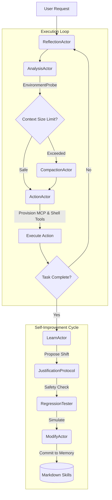

# MidpointX: The Autonomous A2A Reasoning Engine

MidpointX is an advanced, local-first, stateful reasoning engine designed to deliver high-leverage architectural efficiency. Built on an innovative Action-to-Action (A2A) protocol, MidpointX transcends traditional command execution—it autonomously reasons, learns, and evolves its own logic to solve complex software engineering challenges.

By employing a powerful **Cognitive Compaction** strategy within a recursive LangGraph-based architecture, MidpointX avoids the pitfalls of "context rot" and quadratic token growth. The result is a self-healing, highly resilient engineering assistant that operates with laser focus and exceptional cost efficiency.

---

## 🏗️ Architecture & How It Works

MidpointX operates on a decoupled, event-driven architecture using stateful LangGraph nodes known as "Actors." This separation of cognitive labor from mechanical execution ensures optimal performance and scalability.



### Core LangGraph Actors

1. **ReflectionActor (`reflectNode`)**: Initiates the cognitive loop by reviewing the user's intent, uncovering hidden constraints, and identifying potential failure points.
2. **AnalysisActor (`analyzeNode`)**: Ingests the `EnvironmentProbe` fingerprint and dynamic tools to generate a grounded, step-by-step strategy.
3. **ActionActor (`actionNode`)**: Dynamically provisions relevant Model Context Protocol (MCP) tools and shell commands, invoking the Worker LLM to execute the next logical step.
4. **CompactionActor (`compactionNode`)**: Triggered when state tokens exceed safety thresholds. It summarizes reasoning traces, extracts actionable checklists, and prunes action history to maintain a lean context window.
5. **LearnActor (`learnNode`)**: Evaluates completed tasks to determine if a novel approach was required, proposing a structured "Logic Shift" for future optimization.
6. **JustificationProtocol (`justifyNode`)**: Acts as a strict safeguard ("LLM-as-a-judge"), evaluating proposed logic shifts for safety, security, and structural soundness.
7. **RegressionTester (`regressNode`)**: Simulates the proposed shift against concurrent mock tasks to guarantee system stability.
8. **ModifyActor (`modifyNode`)**: Commits the verified logic shift to persistent memory as an autonomous Markdown skill.

---

## 🎯 Key Features

- **Say Goodbye to Context Rot**: The built-in context governor automatically summarizes, prunes, and preserves critical "Action Echoes." This leads to a massive reduction in token overhead during extensive multi-step tasks.
- **Zero-Configuration Portability**: MidpointX’s `EnvironmentProbe` fingerprints your OS, shell, and available binaries on boot. Drop it onto any machine, and it instantly adapts to the available toolset without manual configuration.
- **Self-Improving Memory**: Through the Justification Protocol and Learn Actor, MidpointX constantly evaluates its performance, committing novel operational patterns to its own persistent memory as Markdown skills.
- **Agnostic LLM Tiering**: Support for Google Generative AI (Gemini), Anthropic (Claude), OpenAI, and OpenRouter is native. Use a powerful "Expert Tier" model for strategy and a fast, economical "Worker Tier" model for filesystem operations and compaction.
- **Unhackable Resilience**: The `invokeWithResilience` module wraps all LLM calls, seamlessly handling transient errors with exponential backoff and jitter, while surfacing deterministic faults instantly.

---

## 📖 Complete Setup Guide

### Prerequisites

Ensure your environment meets the following requirements:
* **Node.js** (v18 or higher)
* **npm** or **yarn** package manager
* **API Keys** for your preferred LLM provider (e.g., Google AI Studio, Anthropic, OpenAI, or OpenRouter).

### 1. Clone the Repository

Begin by cloning the MidpointX repository and navigating into the directory:

```bash
git clone https://github.com/your-org/MidpointX.git
cd MidpointX
```

### 2. Install Dependencies

Install the required Node.js packages:

```bash
npm install
```

### 3. Environment Configuration

Copy the provided example environment file to create your local `.env` configuration:

```bash
cp .env.example .env
```

Open the `.env` file and configure your API keys and model preferences:

```env
# Agent Model Selection
ACTIVE_LLM_PROVIDER="google" # Options: 'google', 'anthropic', 'openai', 'openrouter', 'local'
ACTIVE_MODEL_NAME="gemini-2.5-pro" # Your Expert Tier Model
WORKER_MODEL_NAME="gemini-2.5-flash" # Your Worker Tier Model

# API Keys
GEMINI_API_KEY="your_api_key_here"
ANTHROPIC_API_KEY="your_api_key_here"
OPENAI_API_KEY="your_api_key_here"
OPENROUTER_API_KEY="your_api_key_here"

# System Settings (Optional)
PORT=8080
RETRY_COUNT=5
MAX_RECURSION_LIMIT=150
```

### 4. Build the Project

Compile the TypeScript codebase to prepare the system for execution:

```bash
npm run build:full
```

*(Note: If you encounter permission issues with `tsc` on Linux/macOS, you may need to run `chmod +x node_modules/.bin/tsc` first).*

### 5. Start the Engine

To start the production server:

```bash
npm start
```

For local development with hot-reloading (frontend and backend concurrently):

```bash
npm run dev
```

The system will initialize on the port specified in your `.env` (default `8080`), serve the MidpointX UI, and expose the primary A2A negotiation endpoint at `/api/v1/a2a-negotiate`.

---

## 💡 Example Usage

Send a complex task to the agent and watch it reason, execute, and learn.

**Example Task:**

> "Analyze `src/nodes/modifyNode.ts`. Identify if it currently uses the new `invokeWithResilience` wrapper. If it does not, refactor the file to import the resilience layer and wrap the LLM call. After the refactor is complete, ensure the project builds correctly."

MidpointX will autonomously map its environment, read the file, perform the refactor, verify the build, compress its context, and determine if it needs to memorize a new skill—all with zero human intervention.

---

*MidpointX: High-level reasoning, perfected for the local environment.*
