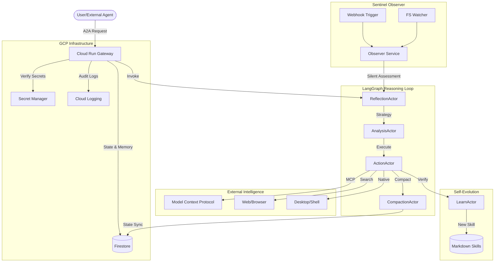

<p align="center">
  
</p>

# MidpointX: The Sovereign Cloud Gateway

**MidpointX** is a production-grade, cloud-native A2A (Agent-to-Agent) reasoning engine designed to operate as a secure, high-fidelity "Sovereign Gateway." Built for the Google Cloud Platform (GCP) ecosystem, MidpointX transcends traditional local-first automation by delivering enterprise-scale persistence, non-repudiable audit trails, and autonomous multi-step orchestration.

By employing a stateful **LangGraph** architecture and **Firestore-backed** memory, MidpointX eliminates "context rot" and scales indefinitely. It is a self-healing, hardened infrastructure for agents that need to reason, learn, and act with grounded truth in a cloud-native environment.

---

## 🏗️ Cloud-Native Architecture

MidpointX is architected for environment parity, allowing seamless transition from local development to production-grade deployment on GCP.



### Core Architecture Pillars

1.  **Sovereign Persistence**: State and long-term memory are decoupled from the local filesystem and managed via **Google Firestore**, ensuring infinite scalability and sub-millisecond state retrieval.
2.  **Hardened Security**: Integrated with **GCP Secret Manager** for zero-leak credential management and **A2A Cryptographic Audit Trails** for non-repudiable action logging.
3.  **Proactive Sentinel**: A built-in "Sentinel" observer monitors filesystem events and webhooks, triggering autonomous reasoning via specialized **Cognitive Worker Swarms**.
4.  **Cognitive Compaction**: High-fidelity context management summarizes reasoning traces and prunes history to maintain optimal performance during complex, multi-day engineering tasks.

---

## 🚀 System Capabilities

### 🧠 1. Cognitive Reasoning
*   **Action-to-Action (A2A)**: Recursive reasoning that allows the agent to pivot strategies autonomously based on environmental feedback.
*   **LangGraph Actor System**: A modular, event-driven loop (Reflection -> Analysis -> Action -> Learning).
*   **Self-Healing Resilience**: Robust retry logic with exponential backoff for all LLM and tool invocations.

### 🌐 2. Cloud-Native Operations
*   **GCP Optimized**: Native support for Cloud Run, Cloud Logging, and Firestore persistence.
*   **Terraform Managed**: Infrastructure-as-Code for 1-click deployment to the GCP Marketplace.
*   **Isolated Session Guard**: Isolated, containerized browser instances (Puppeteer/Chromium) with persistent digital identity.

### 🖥️ 3. Predictive Intelligence (Sentinel)
*   **Observer Pattern**: Real-time monitoring of filesystem events, webhooks, and **Google Workspace (Gmail/Drive) polling**.
*   **Silent Assessment**: Autonomous evaluation using frugal worker models (`flash-lite`) to preserve token budget.
*   **Habit Learning Engine**: Local background tracking of application usage rhythms for predictive workflow automation.
*   **85% Confidence Gate**: Ensures the system only interrupts the operator for high-relevance mission events.

### 📱 4. Multi-Channel Intelligence
*   **Mobile-First Human Doorbell**: Prioritized notifications to Telegram/Discord for proactive approvals (e.g., draft reviews).
*   **Draft-First Safety**: Proactive Workspace actions are held in "Draft" mode, strictly adhering to the "No-Delete" firmware directive.
*   **Universal App Control**: Precision humanoid interaction (mouse/keyboard) and visual grounding via `VisualProbe`.

### 🛡️ 5. Phase III: Sovereign Interoperability & Sleep-Cycle Auto-Skills
*   **Sovereign A2A Gateway (`POST /api/v1/a2a/delegate`)**: Authenticated program-to-program task delegation utilizing **Ed25519 payload signatures** and path-scoped security envelopes (enforcing strict directory boundaries like `D:\playground\PolyTrader`).
*   **Host Audit Trail Ledgers**: Spawns cryptographically signed response objects containing task execution traces and cryptographic signatures to prove execution fidelity and alignment.
*   **Unsupervised Sleep-Cycle Habit Mining**: A background cron-driven workflow miner inside the Sentinel system that clusters repetitive app usage, synthesizes new proactive markdown skills in `src/plugins/skills/` (frequency $\ge 5$), and alerts operators via Telegram.
*   **Stateful Puppeteer Rehydration**: Spawns visible-first browser windows (`headless: false`) and deeply serializes active tabs (cookies, HTML DOM snippets, and `localStorage`/`sessionStorage` tokens) to preserve browser states over long approval gaps.

---

## 📖 Setup & Deployment

### GCP Deployment (Production)

MidpointX is fully containerized and managed via Terraform.

1.  **Configure Terraform**:
    Update `terraform/terraform.tfvars` with your `project_id` and `region`.
2.  **Deploy Infrastructure**:
    ```bash
    cd terraform
    terraform init
    terraform apply
    ```
3.  **Push Container**:
    ```bash
    docker build -t gcr.io/[PROJECT_ID]/midpointx:latest .
    docker push gcr.io/[PROJECT_ID]/midpointx:latest
    ```

### Local Development (Quickstart)

1.  **Install Dependencies**:
    ```bash
    npm install
    ```
2.  **Environment Setup**:
    ```bash
    cp .env.example .env
    ```
    Configure your `.env` with the following GCP-specific keys:
    ```env
    GCP_PROJECT_ID="your-project-id"
    PERSISTENCE_ADAPTER="firestore" # or 'local'
    ENABLE_CLOUD_LOGGING="true"
    ```
3.  **Start Engine**:
    ```bash
    npm run dev
    ```

---

## 💡 Example: A2A Engineering Workflow

> **User**: "Analyze the Terraform config. If it doesn't include Secret Manager replication for the OpenAI key, add it and redeploy."

**MidpointX Workflow:**
1.  **Reflect**: Identifies the goal (Update Terraform) and constraints (Secret replication).
2.  **Analyze**: Probes the `terraform/main.tf` file.
3.  **Action**: Modifies the file using `multi_replace_file_content`.
4.  **Verify**: Runs `terraform plan` to ensure the change is valid.
5.  **Learn**: Records the successful pattern as a new deployment "Theorem" in memory.

---

*MidpointX: Sovereign Automation • Grounded Truth • Cloud Native*
