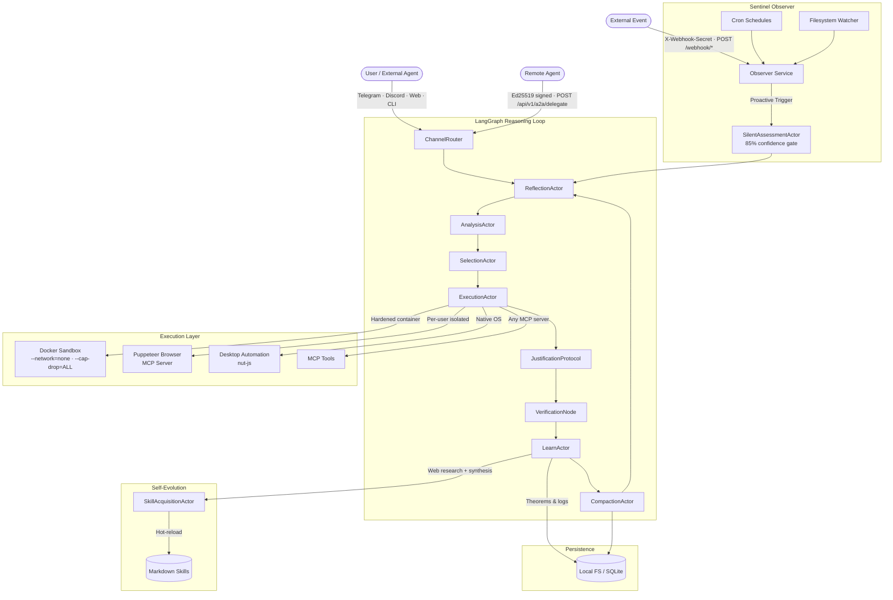

<p align="center">
  
</p>

<p align="center">
  
  
  
  
  
  
</p>

# MidpointX — Sovereign AI Agent Framework

**MidpointX** is a production-grade, self-contained multi-agent reasoning engine. It runs a stateful **LangGraph** cognitive loop across 15+ specialized actor nodes, executes tools inside a **hardened Docker sandbox**, and learns autonomously by synthesizing new skills from web research — all without any cloud infrastructure dependency.

Connect it to Telegram, Discord, a web UI, or another agent via the cryptographically authenticated **A2A (Agent-to-Agent) API** and point it at any of six LLM providers.

---

## Table of Contents

- [Architecture](#architecture)
- [Key Features](#key-features)
- [Quick Start](#quick-start)
- [Configuration](#configuration)
- [LLM Providers](#llm-providers)
- [Input Channels](#input-channels)
- [Tool System](#tool-system)
- [A2A Delegation API](#a2a-delegation-api)
- [Skill System](#skill-system)
- [Security](#security)
- [Project Structure](#project-structure)

---

## Architecture



---

## Key Features

### 🧠 Cognitive Architecture
- **15+ LangGraph actor nodes** — Reflect, Analyze, Select, Execute, Justify, Verify, Learn, Compact, Prune, and dedicated swarm workers (Researcher, Developer, Tester)
- **Human-in-the-Loop breakpoint** — hard interrupt gate before destructive actions
- **Self-healing resilience** — configurable retry with exponential backoff via `p-retry`
- **Context compaction** — automatic summarization when context window pressure builds

### 🐳 Hardened Docker Sandbox
- All shell commands run inside a resource-capped Docker container by default
- Security flags: `--network=none`, `--memory=512m`, `--cpus=0.5`, `--pids-limit=64`, `--read-only`, `--cap-drop=ALL`, `--security-opt=no-new-privileges`
- Graceful fallback to host shell with a loud warning if Docker is unavailable

### 🤖 Multi-Provider LLM
- Switch providers with a single env var: **Anthropic**, **OpenAI**, **OpenRouter**, **Google Gemini**, **NVIDIA NIM**, **Ollama** (local)
- Separate expert and worker model tiers for cost efficiency
- Extended thinking enabled for Claude models (32k token budget)

### 👁️ Proactive Sentinel
- **Cron-triggered skills** — any skill can declare a cron schedule; the Observer fires it autonomously
- **Filesystem watching** — react to file changes in any monitored directory
- **Webhook listener** — `POST /webhook/:path` routes external events into the reasoning loop
- **85% confidence gate** — the `SilentAssessmentActor` classifies triggers as DROP / NOTIFY / ACTION before committing resources
- **Rate limiter (3:15 rule)** — max 3 autonomous triggers per intent per 15 minutes

### 🌐 Browser Automation
- Per-user isolated Puppeteer instances (each with its own Chrome profile on disk)
- Headless (API) or visible mode with live hot-switching
- Session serialization: cookies, DOM snapshots, `localStorage`/`sessionStorage` rehydration across restarts

### 🖥️ Desktop Automation
- Native mouse/keyboard control via `nut-js`
- `scan_screen` — LLM-readable description of active windows
- `find_element` — locate any UI element by natural-language description
- Grid-based visual grounding — 12×8 labeled overlay (A1–L8) for pixel-perfect clicking

### 🔗 A2A Agent Delegation
- Cryptographic handshake: **Ed25519 payload signatures** + safety certificate
- Path-scoped security envelopes enforce strict directory boundaries
- Non-repudiable audit ledger with hash chaining

### 📚 Self-Evolving Skill System
- Capabilities are defined as **Markdown skill files** in `src/plugins/skills/`
- `SkillAcquisitionActor` searches the web (DuckDuckGo), synthesizes new skill files with the LLM, and **hot-reloads** them into the live registry — no restart required
- Skills can declare `schedule`, `watchPath`, or `webhookPath` frontmatter to become autonomous proactive triggers

---

## Quick Start

### Prerequisites

- Node.js 20+
- Docker Desktop (for the sandbox; optional but recommended)
- An API key for at least one [LLM provider](#llm-providers)

### Installation

```bash
git clone https://github.com/VectorZen217/MidpointX-G.git
cd MidpointX-G
npm install
```

### Environment Setup

```bash
cp .env.example .env
```

Edit `.env` with your provider key and model names:

```env
ACTIVE_LLM_PROVIDER="anthropic"
ACTIVE_MODEL_NAME="claude-opus-4-5"
WORKER_MODEL_NAME="claude-haiku-4-5"
ANTHROPIC_API_KEY="sk-ant-..."
```

### Run

```bash
# Full stack (backend + frontend UI)
npm run dev

# Backend only
npm run backend

# CLI mode
npm run cli
```

The server starts on port **5001** by default (`PORT` in `.env`).

---

## Configuration

All configuration is validated at boot via Zod. The agent will print a clear error and exit if a required field is missing.

| Variable | Default | Description |
|---|---|---|
| `ACTIVE_LLM_PROVIDER` | `anthropic` | LLM provider: `anthropic` · `openai` · `openrouter` · `google` · `nvidia` · `local` |
| `ACTIVE_MODEL_NAME` | *(required)* | Expert model name (e.g. `claude-opus-4-5`) |
| `WORKER_MODEL_NAME` | *(required)* | Worker/fast model name for lightweight tasks |
| `PORT` | `5001` | HTTP server port |
| `USE_DOCKER_SANDBOX` | `true` | Run shell commands inside hardened Docker container |
| `SANDBOX_AUTONOMOUS_MODE` | `true` | Skip approval gate for sandboxed commands |
| `REQUIRE_APPROVAL_FOR_DESTRUCTIVE` | `true` | Pause for human approval on host-level destructive ops |
| `PERSISTENCE_ADAPTER` | `local` | `local` (filesystem) or `sqlite` |
| `TOOL_PROFILE` | `full` | `full` · `coding` · `messaging` |
| `ENABLE_VOICE` | `false` | ElevenLabs TTS responses |
| `ENABLE_PROACTIVE_SCHEDULER` | `true` | Enable cron-driven autonomous missions |
| `ENABLE_SCREENSHOTS` | `true` | Visual grounding via screen capture |
| `ENABLE_EMBEDDINGS` | `false` | Semantic RAG memory (requires embedding model) |
| `WEBHOOK_SECRET` | *(optional)* | Min 32-char secret to enable `POST /webhook/*` endpoints |
| `TELEGRAM_BOT_TOKEN` | *(optional)* | Enable Telegram channel |
| `DISCORD_BOT_TOKEN` | *(optional)* | Enable Discord channel |
| `ELEVENLABS_API_KEY` | *(optional)* | Required for voice output |

---

## LLM Providers

| Provider | `ACTIVE_LLM_PROVIDER` | Key Variable |
|---|---|---|
| Anthropic (Claude) | `anthropic` | `ANTHROPIC_API_KEY` |
| OpenAI | `openai` | `OPENAI_API_KEY` |
| OpenRouter | `openrouter` | `OPENROUTER_API_KEY` |
| Google Gemini | `google` | `GEMINI_API_KEY` |
| NVIDIA NIM | `nvidia` | `NVIDIA_API_KEY` |
| Ollama (local) | `local` | *(none — connects to `localhost:11434`)* |

Switch providers by changing `ACTIVE_LLM_PROVIDER` and `ACTIVE_MODEL_NAME` in `.env` — no code changes required.

---

## Input Channels

| Channel | How to Enable |
|---|---|
| **Web UI** | Always available at `http://localhost:5001` |
| **CLI** | `npm run cli` |
| **Telegram** | Set `TELEGRAM_BOT_TOKEN` in `.env` |
| **Discord** | Set `DISCORD_BOT_TOKEN` in `.env` |
| **Webhook** | Set `WEBHOOK_SECRET` (≥32 chars); send `POST /webhook/:path` with `X-Webhook-Secret` header |
| **A2A API** | `POST /api/v1/a2a/delegate` with Ed25519-signed safety certificate |

---

## Tool System

Tools are namespaced by category (`category__tool_name`) and dynamically composed from built-ins and MCP servers:

| Namespace | Tools |
|---|---|
| `execute_system_command` | Shell execution (Docker sandboxed by default) |
| `filesystem__*` | `list_directory`, `read_text_file`, `write_text_file`, `search_files`, `delete_file`, `exists` |
| `browser__*` | `navigate`, `click`, `type`, `fill`, `evaluate`, `screenshot`, `page_content`, `drag_and_drop`, and more |
| `desktop__*` | `mouse_move`, `mouse_click`, `keyboard_type`, `keyboard_press`, `scan_screen`, `find_element`, `take_snapshot`, `take_snapshot_with_grid`, `click_grid_cell` |
| `messaging__*` | `send_telegram` |
| `system__*` | `read_skill`, `update_skill`, `request_replanning` |
| `<server>__*` | Any tools exposed by configured MCP servers |

### Adding MCP Servers

Edit `src/plugins/mcp/mcp_config.json`:

```json
{
  "mcpServers": {
    "my-server": {
      "command": "npx",
      "args": ["-y", "@my-org/mcp-server"],
      "env": { "API_KEY": "your-key" }
    }
  }
}
```

Tools are automatically discovered, namespaced as `my-server__<tool_name>`, and injected into the agent's active tool list at startup.

---

## A2A Delegation API

MidpointX can act as a secure gateway for remote agent orchestration.

### Delegating a Task

```http
POST /api/v1/a2a/delegate
Content-Type: application/json

{
  "intent": "Analyze the build output and fix any TypeScript errors in src/core/",
  "safetyCertificate": {
    "agentId": "nexus-agent-01",
    "allowedPaths": ["D:/projects/myapp/src"],
    "publicKey": "<ed25519-public-key-base64>"
  },
  "payloadSignature": "<ed25519-signature-of-intent>"
}
```

The gateway validates the safety certificate, verifies the Ed25519 signature, checks path scopes against the intent, and routes the task through the full reasoning loop.

### REST Endpoints

| Method | Path | Description |
|---|---|---|
| `POST` | `/api/v1/a2a/delegate` | Delegate a task with cryptographic auth |
| `GET` | `/api/v1/a2a/policies` | List trusted agent certificates |
| `GET` | `/api/v1/a2a/audit-trail` | Full non-repudiable execution ledger |
| `POST` | `/webhook/:path` | External event trigger (requires `X-Webhook-Secret`) |
| `POST` | `/observer/sleep-cycle` | Manually trigger habit-mining sleep cycle |

---

## Skill System

Skills are Markdown files in `src/plugins/skills/`. The agent reads, executes, and writes them at runtime.

### Skill Frontmatter

```markdown
---
name: my-skill
description: What this skill does (shown to the agent during task planning)
schedule: "0 9 * * 1-5"   # optional: cron to run autonomously (weekdays at 9 AM)
watchPath: "./src"          # optional: trigger on filesystem changes
webhookPath: "deploy-hook"  # optional: trigger on POST /webhook/deploy-hook
---

## Instructions
...
```

### Autonomous Skill Acquisition

When the agent encounters a task it lacks a skill for, `SkillAcquisitionActor` will:
1. Search DuckDuckGo for relevant technical information
2. Synthesize a new skill file using the LLM
3. Write it to `src/plugins/skills/`
4. Hot-reload it into the live registry — available immediately for future tasks

---

## Security

| Layer | Mechanism |
|---|---|
| **Sandbox** | Docker with `--network=none`, `--cap-drop=ALL`, memory/CPU/PID limits, read-only FS |
| **Path shielding** | `PolicyEngine` blocks access to paths outside declared scopes |
| **A2A auth** | Ed25519 signature + safety certificate + per-request path scope validation |
| **Webhook auth** | `crypto.timingSafeEqual` comparison of `X-Webhook-Secret` header |
| **Approval gate** | `HumanApprovalGate` LangGraph node pauses destructive host-level actions |
| **Secrets** | `SecretProvider` — env-var resolution with 5-min TTL cache, no network calls |
| **Audit** | Append-only JSONL ledger with hash chaining for tamper detection |

---

## Project Structure

```
src/
├── core/           # Runtime: config, graph, LLM factory, persistence, security
│   ├── config.ts           # Zod-validated environment schema
│   ├── graph.ts            # LangGraph state machine definition
│   ├── llmFactory.ts       # Multi-provider LLM abstraction
│   ├── sandboxManager.ts   # Docker sandbox lifecycle
│   ├── persistence.ts      # Local FS + SQLite adapters
│   ├── pluginRegistry.ts   # MCP + skill loader and tool dispatcher
│   └── observer.ts         # Sentinel (cron, fs watch, webhook routing)
├── nodes/          # LangGraph actor implementations
│   ├── cognitiveNodes.ts   # Reflect, Analyze, Learn, SilentAssessment
│   ├── executionNodes.ts   # SelectionActor, ExecutionActor
│   ├── safeguardNodes.ts   # Justify, Verify, Regression
│   ├── swarmWorkerNodes.ts # Researcher, Developer, Tester
│   └── skillAcquisitionNode.ts
├── plugins/
│   ├── skills/     # Markdown skill files (agent's knowledge base)
│   ├── mcp/        # MCP server configuration (mcp_config.json)
│   ├── browser/    # Puppeteer session serialization
│   └── desktop/    # Native OS automation (nut-js wrappers)
├── services/       # External integrations (Telegram, Discord, A2A)
├── routes/         # Express route handlers (A2A, UI API)
└── tests/          # Integration and unit tests
```

---

*MidpointX — Autonomous Reasoning · Hardened Execution · Self-Evolving*
